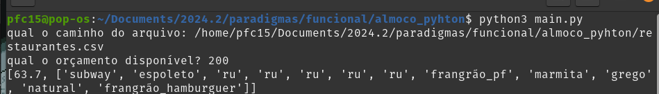
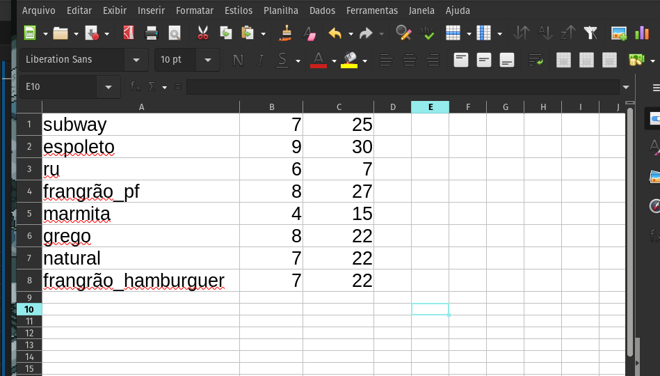

# Campo Minado

**Disciplina**: FGA0210 - PARADIGMAS DE PROGRAMAÇÃO - T01 <br>
**Nro do Grupo**: - <br>
**Paradigma**: Funcional<br>

## Alunos
|Matrícula | Aluno |
| :--: | :--: |
| 21/2005444 | [Pedro fonseca Cruz](https://github.com/pfc15)	|


## Sobre 

Este projeto é uma pequena implementação de um bot de recomendação de lugares para almoçar perto da UnB. Ele utiliza o algorítimo de Knapsack e desencoraja ir para o mesmo lugar várias vezes. Adicione resutanrante no csv com as colunas "nome", "felicidade" e "preco" respectivamente.


## Screenshots
Adicione 2 ou mais screenshots do projeto em termos de interface e/ou funcionamento.





## Execução
**Linguagens**: [python](https://www.python.org/)


### Pré-requisitos

Clone este repositório em seu ambiente local:
```bash
git clone <URL_DO_REPOSITORIO>
cd Recomendar_restaurantes
```

rode o arquivo main.py e interaja com o terminal
```bash
python3 main.py
```
## implementação em Haskell
também há uma implementação em haskell, mas ele não lê o arquivo csv como a implementação em python faz. Para utilizá-la:

```bash
ghc main.hs
```

## Vídeo
Vídeo com a explicação e execução do projeto:
[Apresentação]()


### Lições Aprendidas
Ter um ambiente de desenvolvimento configurado é muito importante e pode tirar muito tempo de desenvolvimento, principalmente com uma linguagem nova.

### Percepções
Usar recursões pode deixar o código bem mais enxuto. É incrivel como em tão poucas linhas se pode fazer tanto. Tinha feito uma implementação de Knapsack semestre passado usando matriz sem recursão e tive que usar por volta de 100 linhas. Agora utilizei 15 pra função inteira.

### Contribuições e Fragilidades
Por algum motivo de incompatibilidade do Haskell e cabal, não foi possível utilizar módulos no Haskell. Isso limitou muito o escopo do que consegui realizar em Haskell. Por isso foi necessário trocar a linguagem para Python, que tem uma configuração de ambiente mais simplificada.

### Trabalhos Futuros
É possivel expandir essa ideia aumentando a quantidade de restaurante e automatizando o placar da felicidade. Uma integração com o google maps pode pegar os restaurantes da área e a nota e o preço deles no google. Então dar uma lista muita mais rica.
